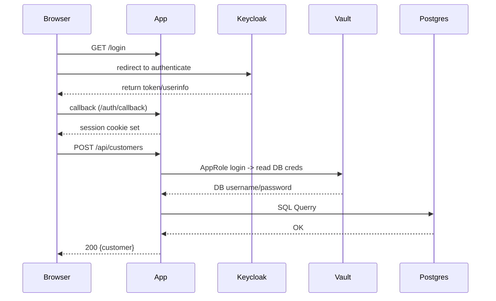

# vault-db

Small Flask demo showing customer onboarding with Vault-backed DB credentials and Keycloak SSO + simple RBAC.

## Overview

- Web app: Flask (`app.py`) — serves UI and JSON APIs for customer records.
- Training catalog: Flask (`app2.py`) — the Amigo Training Portal course list with optional Keycloak SSO.
- Data plane: the application connects to Postgres to read/write customer records. DB credentials can be fetched from HashiCorp Vault on every connection (AppRole -> read static role).
- Management plane: Vault (credential provider) and Keycloak (identity provider). Administrators manage AppRole secrets and database roles in Vault, and create users/groups/clients in Keycloak.

## Key components

- `app.py` — Flask app, RBAC enforcement, web routes.
- `app2.py` — Test app for SSO demo
- `db.py` — DB access layer. Uses `vault_client.get_db_credentials()` when `DB_CONNECTION_METHOD=vault` (default in template) or plain creds from `.env`.
- `vault_client.py` — AppRole login to Vault; reads static DB role path to obtain username/password for DB connections.
- `templates/` — UI for both apps, including the Amigo Training Portal course list.
- `static/` — CSS and images for both apps.

## Data plane vs Management plane

- Data plane
  - App uses short-lived or static DB credentials provided at runtime by Vault to connect to Postgres and read/write customer data.
  - Customer data flow: client browser → Keycloak → Flask app → Vault → Postgres (via DB connection obtained by app).

- Management plane
  - Vault: AppRole credentials (`VAULT_ROLE_ID`, `VAULT_SECRET_ID`) are used by the app to authenticate to Vault and read stored DB credentials. Vault admin rotates or updates DB credentials and static role secrets.
  - Keycloak: Administrators create realm, clients, users, and groups/roles in Keycloak. The app uses OIDC for user authentication and reads `groups` claim for RBAC.

## Request flow

1. User visits `/login` and chooses local login or SSO (`/login/keycloak`).
2. For SSO: app redirects to Keycloak; user authenticates; Keycloak redirects back to `/auth/callback` with token.
3. App obtains token and userinfo (or ID token claims), extracts username and group membership, and stores session info.
4. When the app needs DB access, `db.get_connection()` uses `vault_client.get_db_credentials()` (if `DB_CONNECTION_METHOD=vault`) which:
   - Calls Vault AppRole login (AppRole ROLE_ID + SECRET_ID) to get Vault token.
   - Uses Vault token to read the static role path and returns `username, password` for Postgres.
5. App performs SQL queries/updates using those credentials.

Mermaid sequence (simplified):



## RBAC model

The demo expects three groups in Keycloak (realm `vault-db-demo` by default):

- `view_all` — can view all customer records but cannot create or update.
- `create_own` — can create customers and view/update only customers they processed.
- `create_view_all` — can create and view/update all customers.

Keycloak must include group membership in ID token or userinfo. Add a "Group Membership" mapper on the client (or client-scope) with claim name `groups` and enable it for ID token and userinfo.

## Environment files

This project uses four environment/config files (kept out of git):

- `.env` — primary application settings. Store DB connection defaults (when `DB_CONNECTION_METHOD=plain`), Keycloak OIDC client settings, and other app flags. Typical values:
  - `DB_HOST`, `DB_PORT`, `DB_NAME`, `DB_CONNECTION_METHOD` (`plain` or `vault`), `DB_USER`, `DB_PASSWORD`
  - `KEYCLOAK_BASE`, `KEYCLOAK_REALM`, `KEYCLOAK_CLIENT_ID`, `KEYCLOAK_CLIENT_SECRET`, `KEYCLOAK_SKIP_VERIFY`

- `.encrypt.env` — encryption-related configuration. Keeps settings that determine encryption mode used by the app (e.g. `ENCRYPT_MODE=fernet|transit|None`) and any per-mode parameters consumed by the encryption utilities.

- `.encryption.key` — optional file used by the encryption utilities (for example a local Fernet key or transit configuration placeholder). If using `transit` mode and local testing, store the key material here; in production the app should rely on Vault transit.

- `.vault.env` — Vault connection settings used by `vault_client.py` (this file is loaded by the Vault client helper). Typical variables:
  - `VAULT_ADDR`, `VAULT_ROLE_ID`, `VAULT_SECRET_ID`, `STATIC_ROLE_PATH`, `VAULT_SKIP_VERIFY`

Place these files in the project root. The app contains a small loader that reads `.env` and `.vault.env` if present — values set in the process environment take precedence.

## Quick run

1. Copy the provided `.env` template and populate secrets for your environment (Keycloak, DB, Vault as needed).

2. Install dependencies and start the app:

```bash
pip install -r requirements.txt
python app.py
```

3. Open `http://localhost:8002/login` in your browser.

To run the Amigo Training Portal, start `python app2.py` and open `http://localhost:8003/login`. After signing in, app2 displays its Red Hat training course list. Its local fallback username and password are defined by `APP_USER` and `APP_PASS` in `app2.py`; replace those demo values before use. For Keycloak setup, see the SSO notes below.

For a single-sign-on demo across both apps, use the same Keycloak realm but create a separate OIDC client for each app. Keep the realm/base URL shared, configure `KEYCLOAK_CLIENT_ID` and `KEYCLOAK_CLIENT_SECRET` for `app.py`, and set `APP2_KEYCLOAK_CLIENT_ID=demo-app2` and `APP2_KEYCLOAK_CLIENT_SECRET` for `app2.py`. App2 defaults to the `demo-app2` client ID and does not reuse app.py's client secret. Register `http://localhost:8002/auth/callback` as the valid redirect URI for the app.py client and `http://localhost:8003/auth/callback` for the app2 client. Both clients should use OIDC standard flow and be confidential server-side clients. Sign in to one app, then use Keycloak sign-in in the other without ending the Keycloak session; the existing realm SSO session should authenticate the second app without another password prompt.

Both apps validate the Keycloak session by exchanging its refresh token on each request. If Keycloak has ended the realm/client session, the refresh is rejected and the app session is cleared. A temporary Keycloak/network error returns HTTP 503 rather than silently treating the user as logged out. Refresh tokens are stored in a server-side SQLite file (`.keycloak_tokens.sqlite3` by default); set `KEYCLOAK_TOKEN_STORE` to choose another path. Configure the Keycloak Client Session Idle timeout to control how long the SSO session remains active.

## Troubleshooting

- If Keycloak token has no `groups` claim, add a Group Membership mapper to the client and re-login users.
- For TLS errors to Keycloak, either fix the cer

Certificate chain or set `KEYCLOAK_SKIP_VERIFY=true` in env (dev only). For DNS/connectivity issues, ensure `KEYCLOAK_BASE` is reachable from the app host.
- If a Keycloak session expires, the next app request redirects to login. If Keycloak cannot be reached, the app returns HTTP 503 and keeps the session so a transient outage does not force a new login.

## Tests

This repo does not include automated tests yet. Basic manual checks:

- Local login with `APP_USER`/`APP_PASS` should give `create_view_all` privileges (used for local testing).
- Create users in Keycloak and assign them to groups; verify UI and API behavior.

---

<!-- If you want, I can add a minimal `make test` or a small pytest module that asserts RBAC returns 403/200 for sample sessions. Tell me if you'd like that next. -->
