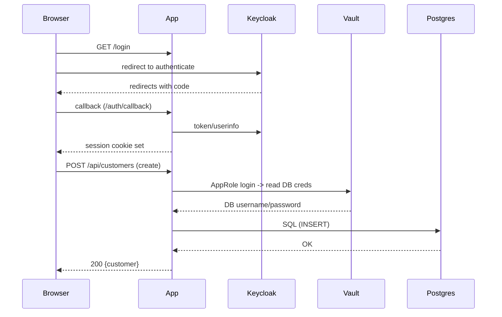

# vault-db

Small Flask demo showing customer onboarding with Vault-backed DB credentials and Keycloak SSO + simple RBAC.

## Overview

- Web app: Flask (`app.py`) — serves UI and JSON APIs for customer records.
- Data plane: the application connects to Postgres to read/write customer records. DB credentials can be fetched from HashiCorp Vault on every connection (AppRole -> read static role).
- Management plane: Vault (credential provider) and Keycloak (identity provider). Administrators manage AppRole secrets and database roles in Vault, and create users/groups/clients in Keycloak.

## Key components

- `app.py` — Flask app, login endpoints (local fallback + Keycloak OIDC), RBAC enforcement, web routes.
- `db.py` — DB access layer. Uses `vault_client.get_db_credentials()` when `DB_CONNECTION_METHOD=vault` (default in template) or plain creds from `.env`.
- `vault_client.py` — AppRole login to Vault; reads static DB role path to obtain username/password for DB connections.
- `templates/` — UI: `login.html`, `dashboard.html`.
- `static/` — CSS and images (SSO logo, etc.).

## Data plane vs Management plane

- Data plane
  - App uses short-lived or static DB credentials provided at runtime by Vault to connect to Postgres and read/write customer data.
  - Customer data flow: client browser → Keycloak → Flask app → Vault → Postgres (via DB connection obtained by app).

- Management plane
  - Vault: AppRole credentials (`VAULT_ROLE_ID`, `VAULT_SECRET_ID`) are used by the app to authenticate to Vault and read stored DB credentials. Vault admin rotates or updates DB credentials and static role secrets.
  - Keycloak: Administrators create realm, clients, users, and groups/roles in Keycloak. The app uses OIDC for user authentication and reads `groups` claim for RBAC.

## Request flow

1. User visits `/login` and chooses local login or SSO (`/login/keycloak`).
2. For SSO: app redirects to Keycloak; user authenticates; Keycloak redirects back to `/auth/callback` with token.
3. App obtains token and userinfo (or ID token claims), extracts username and group membership, and stores session info.
4. When the app needs DB access, `db.get_connection()` uses `vault_client.get_db_credentials()` (if `DB_CONNECTION_METHOD=vault`) which:
   - Calls Vault AppRole login (AppRole ROLE_ID + SECRET_ID) to get Vault token.
   - Uses Vault token to read the static role path and returns `username, password` for Postgres.
5. App performs SQL queries/updates using those credentials.

Mermaid sequence (simplified):



## RBAC model

The demo expects three groups in Keycloak (realm `vault-db-demo` by default):

- `view_all` — can view all customer records but cannot create or update.
- `create_own` — can create customers and view/update only customers they processed (ownership tracked in `processed_by`).
- `create_view_all` — can create and view/update all customers.

Keycloak must include group membership in ID token or userinfo. Add a "Group Membership" mapper on the client (or client-scope) with claim name `groups` and enable it for ID token and userinfo.

## Environment / quick run

Copy the included `.env` template and fill secrets:

- `KEYCLOAK_BASE`, `KEYCLOAK_REALM`, `KEYCLOAK_CLIENT_ID`, `KEYCLOAK_CLIENT_SECRET`
- Vault variables: `VAULT_ADDR`, `VAULT_ROLE_ID`, `VAULT_SECRET_ID`, `STATIC_ROLE_PATH` (if using Vault)
- DB variables: `DB_HOST`, `DB_PORT`, `DB_NAME`, and either `DB_CONNECTION_METHOD=plain` with `DB_USER`/`DB_PASSWORD`, or `DB_CONNECTION_METHOD=vault`.

Install and run:

```bash
pip install -r requirements.txt
python app.py
```

Then open `http://localhost:8002/login`.

## Troubleshooting

- If Keycloak token has no `groups` claim, add a Group Membership mapper to the client and re-login users.
- For TLS errors to Keycloak, either fix the certificate chain or set `KEYCLOAK_SKIP_VERIFY=true` in env (dev only). For DNS/connectivity issues, ensure `KEYCLOAK_BASE` is reachable from the app host.
- Session cookie size: storing the whole token in session can grow cookie size; if you hit cookie size issues, switch to storing only minimal claims or keep the debug token out of session.

## Tests

This repo does not include automated tests yet. Basic manual checks:

- Local login with `APP_USER`/`APP_PASS` should give `create_view_all` privileges (used for local testing).
- Create users in Keycloak and assign them to groups; verify UI and API behavior.

---

<!-- If you want, I can add a minimal `make test` or a small pytest module that asserts RBAC returns 403/200 for sample sessions. Tell me if you'd like that next. -->
